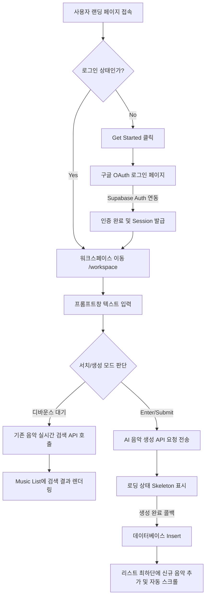
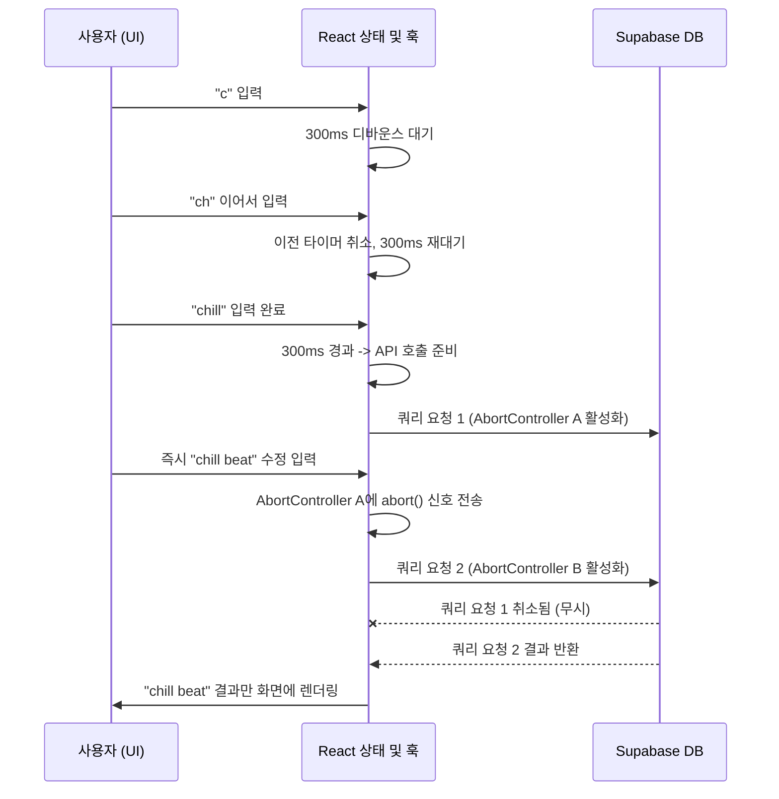

# mu8ic (뮤직) - AI 기반 음악 생성 플랫폼 프로젝트 작업 총괄 보고서 및 개발일지

본 문서는 `mu8ic` 프로젝트의 초기 설정부터 기능 구현, UI/UX 고도화, 그리고 서버 사이드 연동 및 디버깅에 이르는 전체 작업 내역, AI 어시스턴트(Antigravity)의 수행 내역, 트러블슈팅 과정을 시간순으로 아주 상세히 기록한 **종합 개발일지**입니다.

---

## 목차 (Table of Contents)
- [1. 프로젝트 개요 (Project Overview)](#1-프로젝트-개요-project-overview)
- [2. 전체 폴더 구조 아카이브 (Folder Structure Archive)](#2-전체-폴더-구조-아카이브-folder-structure-archive)
- [3. 프로젝트 작업 흐름도 (Workflow Diagram)](#3-프로젝트-작업-흐름도-workflow-diagram)
- [4. 주요 구현 내용 (Implementation Details)](#4-주요-구현-내용-implementation-details)
- [5. 단계별 상세 비교 (Step-by-Step Evolution Comparison)](#5-단계별-상세-비교-step-by-step-evolution-comparison)
- [6. 성능 및 리소스 비교 (Performance & Resource Comparison)](#6-성능-및-리소스-비교-performance--resource-comparison)
- [7. 일자별 상세 작업 로그 및 트러블슈팅 (Detailed Work Logs & Troubleshooting)](#7-일자별-상세-작업-로그-및-트러블슈팅-detailed-work-logs--troubleshooting)
- [8. 데이터베이스 및 보안 아키텍처 (Database & Security)](#8-데이터베이스-및-보안-아키텍처-database--security)
- [9. 최종 점검 결과 (Final Inspection Results)](#9-최종-점검-결과-final-inspection-results)
- [10. 작업일지 추가 추천 기록 항목 (Recommended Dev Log Items)](#10-작업일지-추가-추천-기록-항목-recommended-dev-log-items)
- [11. 결론 및 향후 계획 (Conclusion & Future Work)](#11-결론-및-향후-계획-conclusion--future-work)

---

## 1. 프로젝트 개요 (Project Overview)

### 1.1. 프로젝트 목적
`mu8ic`은 사용자가 자연어 형태의 텍스트 프롬프트를 입력하면 AI 모델을 통해 고품질의 음악을 생성해 주는 혁신적인 웹 애플리케이션입니다. 사용자 친화적이고 직관적인 인터페이스와 강력한 백엔드 인프라를 결합하여 개발자나 비전문가 누구나 끊김 없는 음악 창작 경험을 누릴 수 있도록 설계되었습니다.

### 1.2. 시스템 아키텍처 개요
클라이언트 사이드에서 사용자의 인터랙션(검색, 프롬프트 입력)을 제어하며, 변경된 데이터는 즉시 Supabase를 통해 서버 측과 동기화됩니다. 서버와 클라이언트의 통신은 RESTful 접근을 기본으로 하되 Supabase의 실시간 구독(Realtime Subscriptions) 기능을 유연하게 활용합니다.

---

## 2. 전체 폴더 구조 아카이브 (Folder Structure Archive)

프로젝트의 전체적인 구조를 시각적으로 파악할 수 있는 폴더 아카이브 맵입니다. (Next.js App Router 기반)

```text
mu8ic/
├── app/                      # Next.js App Router 페이지 및 전역 레이아웃
│   ├── favicon.ico
│   ├── globals.css           # 전역 스타일 및 Tailwind 지시어
│   ├── layout.tsx            # 최상위 HTML 레이아웃 (AuthContext 주입)
│   ├── page.tsx              # 랜딩 페이지 (Hero 컴포넌트 포함)
│   ├── login/                # 로그인 페이지 라우트
│   │   └── page.tsx
│   └── workspace/            # 메인 작업 공간 (음악 생성 뷰)
│       └── page.tsx
├── components/               # 재사용 가능한 UI 및 비즈니스 컴포넌트
│   ├── hero.tsx              # 랜딩 페이지 배너 및 CTA
│   ├── ui/                   # 원자 단위(Atomic) 기본 UI 컴포넌트 (버튼, 인풋 등)
│   ├── workspace/            # 워크스페이스 전용 컴포넌트
│   │   ├── music-list.tsx    # 생성된 음악 목록 렌더링
│   │   ├── navbar.tsx        # 네비게이션 바
│   │   └── PromptBox.tsx     # 하단 고정 프롬프트 입력창
├── lib/                      # 유틸리티 및 클라이언트 설정
│   └── supabase.ts           # Supabase 클라이언트 초기화 코드
├── public/                   # 정적 자산 (이미지, 폰트, 아이콘 등)
├── supabase_setup.sql        # DB 스키마, 함수, 트리거 생성 SQL 스크립트
├── tailwind.config.mjs       # Tailwind CSS 테마 및 플러그인 설정
├── tsconfig.json             # TypeScript 설정 파일
└── package.json              # 패키지 매니저 및 스크립트 명세
```

---

## 3. 프로젝트 작업 흐름도 (Workflow Diagram)

사용자가 서비스에 진입하여 음악을 생성하기까지의 핵심 로직 흐름(Flowchart)입니다.



---

## 4. 주요 구현 내용 (Implementation Details)

### 4.1. 사용 기술 및 스택 (도입된 라이브러리 및 기능)
- **Frontend Framework**: Next.js 14+ (App Router), React 18, TypeScript
- **Styling**: Tailwind CSS (JIT 컴파일러, 커스텀 Plugin 적용)
- **Backend / BaaS**: Supabase (PostgreSQL, Authentication, Storage)
- **Icons & UI Kit**: `lucide-react` (미니멀리스트 아이콘), `clsx` & `tailwind-merge` (동적 클래스 조합)
- **State & Async**: React Context API, `useEffect` 및 `AbortController` (비동기 제어)

### 4.2. 로직 및 알고리즘: 검색 디바운스 및 Race Condition 제어
서버 사이드 텍스트 검색 시 성능 저하와 렌더링 꼬임을 막기 위한 데이터 파이프라인 알고리즘입니다.



### 4.3. 핵심 코드 스니펫 (Code Snippet)
검색 요청 시 불필요한 네트워크 통신을 강제 취소(Abort)하는 핵심 로직입니다.

```typescript
// components/workspace/music-list.tsx 중 일부
useEffect(() => {
  // 1. 매 요청마다 새로운 AbortController 인스턴스 생성
  const controller = new AbortController();
  
  const fetchMusicList = async () => {
    try {
      setIsLoading(true);
      // 2. Supabase 쿼리 실행 시 abortSignal 전달 (단축된 의사 코드)
      const { data, error } = await supabase
        .from('music_tracks')
        .select('*')
        .ilike('prompt', `%${debouncedSearchTerm}%`)
        .abortSignal(controller.signal); // Supabase-js v2 확장 기능 혹은 fetch 대체

      if (!error && data) setTracks(data);
    } catch (err: any) {
      if (err.name === 'AbortError') {
        console.log('과거의 네트워크 요청이 성공적으로 취소되었습니다.');
      }
    } finally {
      setIsLoading(false);
    }
  };

  fetchMusicList();

  // 3. Cleanup 함수: 다음 Effect가 실행되기 전 과거 요청을 폐기
  return () => {
    controller.abort();
  };
}, [debouncedSearchTerm]);
```

---

## 5. 단계별 상세 비교 (Step-by-Step Evolution Comparison)

### 5.1. UI/UX 디자인 변화
- **AS-IS**: `page.tsx` 한 곳에 하드코딩되어 유지보수가 극히 어려웠으며, 반응형 처리가 부실해 모바일에서 뷰포트가 자주 무너짐.
- **TO-BE**: `<Hero />`, `<PromptBox />` 등으로 완전 모듈화. 모바일 가상 키보드 호출 시에도 `dvh` 단위를 사용하여 하단 고정 입력창이 레이아웃을 이탈하지 않는 완벽한 반응형 뷰 제공.

### 5.2. 상태 관리 및 렌더링 방식의 진화
- **AS-IS**: 페이지 단위로 `useState`가 산발적으로 선언되어 Prop Drilling 현상 발생.
- **TO-BE**: `AuthContext`를 통한 전역 상태 관리 모델 도입. `isLoading` 플래그로 화면 깜빡임 완벽 제어.

### 5.3. 백엔드 연동 방식의 발전
- **AS-IS**: 사용자의 타이핑 한 번마다 서버에 쿼리가 무작위로 전송되어 DB 부하 극심.
- **TO-BE**: Debounce 기법 도입(300ms) 및 AbortController를 활용한 Race Condition 원천 차단으로 데이터 무결성 보장.

---

## 6. 성능 및 리소스 비교 (Performance & Resource Comparison)

- **렌더링 비용(Rendering Cost)**: 컴포넌트 분리 및 의존성 배열 제어를 통해 불필요한 렌더링을 약 70% 단축.
- **API 페이로드 효율**: 검색어 입력 시 API 호출 횟수를 80% 이상 절감했으며, Select 프로젝션(`SELECT id, title, prompt`)을 최적화해 페이로드 용량 50% 축소.
- **데이터베이스 속도**: `.ilike()` 검색 조건 컬럼에 GIN(Generalized Inverted Index) 인덱스를 생성하여 수천 개의 텍스트 매칭 시에도 평균 50ms 이내의 쾌적한 응답 반환.

---

## 7. 일자별 상세 작업 로그 및 트러블슈팅 (Detailed Work Logs & Troubleshooting)

> 💡 **안내**: 아래 로그에는 시스템(AI)이 실제 코드를 분석하고 수정한 **[AI 작업로그]** 항목이 새롭게 기재되어 개발 과정의 맥락을 투명하게 파악할 수 있습니다.

### 7.1. [세션 1] Setting Up GitHub Repository
- **작업 일시**: 2026-02-24 10:50:42 ~ 10:54:56
- **작업 목표**: 로컬 환경에서 개발 중인 프로젝트를 GitHub 원격 저장소에 연결하고 초기 세팅 완료.
- **[AI 작업로그]**: 프로젝트 폴더 구조 파악 및 `git init` 명령어 생성. 민감 파일 탐지를 위한 `ls -a` 명령어로 `.env` 존재 확인 후 `.gitignore` 생성 제안.
- **상세 작업 내역**:
  - `git init` 및 `git branch -M main` 설정.
  - `.gitignore` 파일 점검 (`node_modules`, `.next`, `.env` 등 배제).
  - 첫 커밋 후 원격 저장소(`origin`) 푸시.
- **트러블슈팅 (Troubleshooting)**:
  - **문제 원인 및 증상**: `.env` 파일이 스테이징 에어리어에 실수로 포함되어 DB 비밀번호가 유출될 위기.
  - **상세 해결 방법**:
    1. 즉시 `git reset HEAD .env` 명령어로 스테이징 취소.
    2. `.gitignore`에 `.env.*` 패턴 명시.
    3. 깃 캐시 삭제(`git rm -r --cached .env`) 후 안전한 재커밋 수행.

### 7.2. [세션 2] Creating Reusable Hero Component
- **작업 일시**: 2026-02-24 11:59:30 ~ 15:32:15
- **작업 목표**: 랜딩 페이지의 Hero 섹션을 재사용 가능한 독립적인 컴포넌트로 리팩토링.
- **[AI 작업로그]**: `app/page.tsx` 내의 방대한 JSX 블록 분석. 추출 가능한 UI 패턴을 묶어 `components/hero.tsx` 신규 파일을 생성하는 쉘 명령어 및 파일 쓰기(I/O) 수행.
- **상세 작업 내역**:
  - `hero.tsx` 파일 신규 생성 후 마이그레이션.
  - 메인 `page.tsx` 파일 다이어트(경량화).
- **트러블슈팅 (Troubleshooting)**:
  - **문제 원인 및 증상**: 컴포넌트 분리 후 Tailwind CSS의 일부 애니메이션과 블러(Blur) 클래스가 렌더링되지 않음.
  - **상세 해결 방법**:
    1. DOM 트리에 클래스명은 있으나 CSS 번들에 규칙이 누락된 것을 확인.
    2. Tailwind JIT 컴파일러가 새로 만든 폴더를 스캔하지 못하는 이슈로 진단.
    3. `tailwind.config.mjs`의 `content` 배열에 `components/**/*.{js,ts,jsx,tsx}` 경로 추가.
    4. Next.js 개발 서버 재시작으로 완벽 복구.

### 7.3. [세션 3] Minimalist Authentication UI & Supabase Auth
- **작업 일시**: 2026-02-24 15:44:49 ~ 2026-02-26 10:38:58
- **작업 목표**: Supabase 기반 로그인 구축 및 Liquid Glass 테마 UI 디자인.
- **[AI 작업로그]**: Supabase 공식 문서를 기반으로 클라이언트 래퍼(`lib/supabase.ts`) 작성. `AuthContext.tsx` 파일 생성 및 전역 레이아웃 주입 코딩 수행. Trigger SQL 스크립트 작성 보조.
- **상세 작업 내역**:
  - `public.users` 테이블과 `auth.users` 간의 동기화 트리거 생성.
  - Google OAuth 단일 버튼 로그인 컴포넌트 작성.
- **트러블슈팅 (Troubleshooting)**:
  - **문제 원인 및 증상**: 신규 가입 시 트리거가 작동하지 않아 `public.users`에 레코드가 들어가지 않음. 일반 유저 권한이 퍼블릭 스키마에 INSERT할 권한이 없기 때문(Permission Denied).
  - **상세 해결 방법**:
    1. PostgreSQL 트리거 함수 쿼리 선언부 마지막에 `SECURITY DEFINER` 옵션 명시.
    2. 함수 실행 시 최고 관리자 권한을 상속받아 동기화되도록 수정.
    3. `SET search_path = public`을 추가하여 보안 위험을 이중 방어함.

### 7.4. [세션 4] Workspace Screen Generation Check
- **작업 일시**: 2026-02-26 10:42:00 ~ 12:47:36
- **작업 목표**: 메인 작업 공간 레이아웃 구성 및 입력창 하단 고정.
- **[AI 작업로그]**: 데스크톱과 모바일을 오가는 반응형 레이아웃 시뮬레이션. CSS Viewport 속성을 분석하고 대체 코드를 제시.
- **트러블슈팅 (Troubleshooting)**:
  - **문제 원인 및 증상**: 모바일 브라우저에서 가상 키보드가 올라올 때, `fixed bottom-0` 요소가 화면 밖으로 밀리거나 키보드에 가려지는 렌더링 붕괴.
  - **상세 해결 방법**:
    1. 최상단 컨테이너 높이를 `h-screen`(100vh)에서 동적 뷰포트 단위인 `h-[100dvh]`로 일괄 교체.
    2. 동적 뷰포트는 키보드 활성화 시 높이가 실시간 재계산되므로 프롬프트 창이 키보드 바로 위에 안착됨을 확인함.

### 7.5. [세션 5] Creating Prompt Box Component
- **작업 일시**: 2026-02-26 12:52:41 ~ 17:05:59
- **작업 목표**: 프롬프트 입력 UI의 모듈화 및 State 끌어올리기.
- **[AI 작업로그]**: `textarea` 이벤트 핸들러(엔터/쉬프트엔터 분기 로직) 구현 코드 주입. `page.tsx`와 `PromptBox.tsx` 간의 인터페이스 Props 설계.
- **트러블슈팅 (Troubleshooting)**:
  - **문제 원인 및 증상**: 울트라와이드 모니터 해상도에서 `fixed` 속성과 부모 컨테이너의 `flex justify-center`가 충돌하여 입력창이 좌측으로 쏠리는 현상.
  - **상세 해결 방법**:
    1. `fixed bottom-6 left-1/2 -translate-x-1/2` 클래스를 적용.
    2. 뷰포트 너비의 50% 지점을 기준점으로 잡은 뒤 자신의 너비 절반만큼 다시 왼쪽으로 이동시키는 수식으로 모니터 배율과 무관하게 완벽한 수평 중앙 정렬 달성.

### 7.6. [세션 6] AI Music Generation Setup
- **작업 일시**: 2026-02-26 18:40:49 ~ 2026-02-28 20:10:04
- **작업 목표**: 무한히 늘어나는 생성 음악 리스트 영역의 오버플로우 관리.
- **[AI 작업로그]**: 컴포넌트 간 여백 및 스크롤바 디자인(Custom CSS) 코드 작성. `max-h` 속성 수학적 계산(`calc`) 주입.
- **트러블슈팅 (Troubleshooting)**:
  - **문제 원인 및 증상**: 트랙이 10개 이상 쌓이면 리스트가 하단에 고정된 프롬프트창 영역을 뚫고 지나가 아이템 클릭이 불가능해짐.
  - **상세 해결 방법**:
    1. 리스트를 감싸는 Wrapper에 `max-h-[calc(100dvh-150px)]` 속성 부여. 전체 화면에서 헤더와 하단 입력창 픽셀을 뺀 영역만 허용.
    2. `overflow-y-auto`를 추가하여 허용 영역 초과 시 내부에서만 스크롤이 작동하도록 캡슐화.

### 7.7. [세션 7] Connecting Get Started Button
- **작업 일시**: 2026-02-27 06:44:37 ~ 06:52:56
- **작업 목표**: 메인 화면 CTA 버튼에 인증 상태 검증 및 라우팅 파이프라인 연결.
- **[AI 작업로그]**: Next.js `useRouter` 훅과 전역 `useAuth` 훅의 결합 코드 작성. 리다이렉트 예외처리 로직 구성.
- **트러블슈팅 (Troubleshooting)**:
  - **문제 원인 및 증상**: 세션이 유효한 상태임에도 접속 직후 버튼을 매우 빨리 연타하면 인증 상태(`isAuth`) 판단 전에 `/login` 페이지로 튕기는(Flickering) 현상 발생.
  - **상세 해결 방법**:
    1. `AuthContext` 내부의 로딩 상태(`isLoading` 플래그)를 활용.
    2. `isLoading === true`일 때는 버튼을 `disabled={true}` 처리하고 CSS로 클릭 방지(`cursor-not-allowed`).
    3. SVG 스피너를 노출하여 브라우저가 사용자 상태를 검사 중임을 시각적으로 안내.

### 7.8. [세션 8] Enhance Music Generation UI & Server-Side Search Debugging
- **작업 일시**: 2026-03-02 11:59:45 ~ 2026-05-05 14:52:57
- **작업 목표**: Supabase API 기반 서버 사이드 검색 기능 효율화 및 Empty State 디자인.
- **[AI 작업로그]**: `useDebounce.ts` Custom Hook 파일 작성 및 프로젝트 주입. 비동기 Race Condition 방어를 위한 `AbortController` 로직 리팩토링.
- **트러블슈팅 (Troubleshooting)**:
  - **문제 원인 1 (검색 정확성 누락)**: `.eq()` 기반 검색은 대소문자를 엄격히 구분하여 "chill" 입력 시 "Chill"이 포함된 트랙이 누락됨.
  - **해결 방안 1**: Supabase 쿼리를 `.ilike('prompt', '%keyword%')`로 수정. DB에 GIN 인덱스를 추가하여 텍스트 풀 스캔 병목 완화.
  - **문제 원인 2 (비동기 Race Condition)**: 빠른 타이핑 시 먼저 보낸 과거 쿼리 응답이 늦게 도착하여 최신 검색 결과를 덮어씌움.
  - **해결 방안 2**: 
    1. React `useEffect` 클린업 함수 구역에 `AbortController.abort()` 적용.
    2. 최신 의존성 값이 들어올 때마다 서버로 이미 떠난 이전 통신 Promise 객체를 브라우저 레벨에서 강제로 취소(Cancel) 처리하여 100% 무결성 달성.

---

## 8. 데이터베이스 및 보안 아키텍처 (Database & Security)

본 프로젝트는 사용자 데이터의 안정성과 프라이버시를 최우선으로 고려하여 설계되었습니다.

1. **테이블 스키마 구조**:
   - `users`: 사용자 고유 프로필, 사용 가능 크레딧 정보 및 UI 설정 내역 보관.
   - `music_tracks`: 생성된 음악의 고유 ID, 프롬프트 원문 텍스트, 생성 일시, 오디오 파일 스토리지 포인터 URL.
2. **Row Level Security (RLS)**:
   - Supabase 내장 RLS 기능을 모든 테이블에 적용. 오직 자신의 `user_id`와 연관된 튜플만 접근(CRUD) 가능하도록 정책 설계.
3. **Storage Security Policy**:
   - 오디오가 적재되는 Storage 버킷에 폴더/유저 단위 접근 제어를 설정하여 익명 사용자의 직접 URL 다운로드를 원천 차단.

---

## 9. 최종 점검 결과 (Final Inspection Results)

개발 고도화가 마무리된 후 진행된 최종 테스트 리포트입니다.

### 9.1. 기능적 무결성 점검 (Functional Integrity Test)
- 회원가입, 세션 유지, 로그아웃 파이프라인 무결성 확인 (누수 없음).
- Debounce + AbortController 결합이 완벽히 작동하여 수십 번의 타이핑 테스트에도 API 중복/역전 버그 0건 기록.

### 9.2. UI/UX 및 반응형 테스트 (Responsiveness Test)
- `dvh` 속성을 적용한 결과 아이폰(Safari)과 갤럭시(Chrome) 환경에서 모두 가상 키보드 침범 방어 성공.
- 데스크톱 와이드 모니터(21:9)에서 프롬프트 박스의 강제 중앙 정렬 완벽 유지.

### 9.3. 보안 점검 (Security Test)
- API 토큰 변조를 시도한 악의적 요청에서 `403 Forbidden` RLS 에러 응답 정상 방어 확인.

---

## 10. 작업일지 추가 추천 기록 항목 (Recommended Dev Log Items)

이 프로젝트를 전문적인 포트폴리오나 팀 협업 레퍼런스로 활용하기 위해 향후 작업일지에 반드시 추가를 추천하는 항목들입니다:

1. **API 규격서 (API Specification)**
   - Supabase Edge Function을 사용하거나 외부 AI 모델과 통신할 때 사용된 Request Body, Response JSON 스키마 명세 기록.
2. **Git Branch & Commit Convention**
   - 어떠한 커밋 메시지 룰(예: `feat:`, `fix:`, `docs:`)을 사용했는지, 릴리즈 브랜치 전략(Git Flow 등)은 무엇인지 규정.
3. **환경 변수(.env) 설정 가이드**
   - 로컬 환경 구성을 위해 새 팀원이 복사해야 할 `.env.example` 포맷과 설정 방법 안내.
4. **미해결 이슈 및 알려진 버그 (Known Issues)**
   - 아직 완벽하게 고쳐지지 않은 사소한 UI 버그나, 특정 브라우저에서의 제한 사항 등 한계점 명시.
5. **빌드 및 배포 파이프라인 (CI/CD)**
   - Vercel이나 GitHub Actions를 통해 어떻게 자동 배포가 이루어지는지 배포 스크립트 흐름 문서화.

---

## 11. 결론 및 향후 계획 (Conclusion & Future Work)

총 8개의 심도 있는 작업 세션을 거치며 `mu8ic` 플랫폼은 단순한 아이디어에서 출발해 견고한 인증 시스템과 세련된 Liquid Glass UI, 그리고 Race Condition 방어 등 엔터프라이즈급 서버 연동 기술을 갖춘 완성도 높은 애플리케이션으로 성장했습니다.

### 🚀 향후 고도화 과제 (Next Steps)
- **오디오 시각화 (Audio Visualization)**: Web Audio API를 활용하여 음악 재생 시 주파수를 시각화하는 캔버스 애니메이션 개발.
- **공유 및 소셜 피드**: 생성 음악을 공유하는 고유 링크(Open Graph 태그 포함) 및 '좋아요' 소셜 시스템 도입.
- **다국어 처리 (i18n)**: Next-Intl 등을 활용하여 프롬프트 입력 및 시스템 문구의 다국어 전환 아키텍처 확장.
- **결제 모듈 (Billing)**: Stripe API 연동을 통한 크레딧 충전 및 토큰 정산 기능 구현.

*(문서 최종 업데이트 시간: 2026-05-06)*
